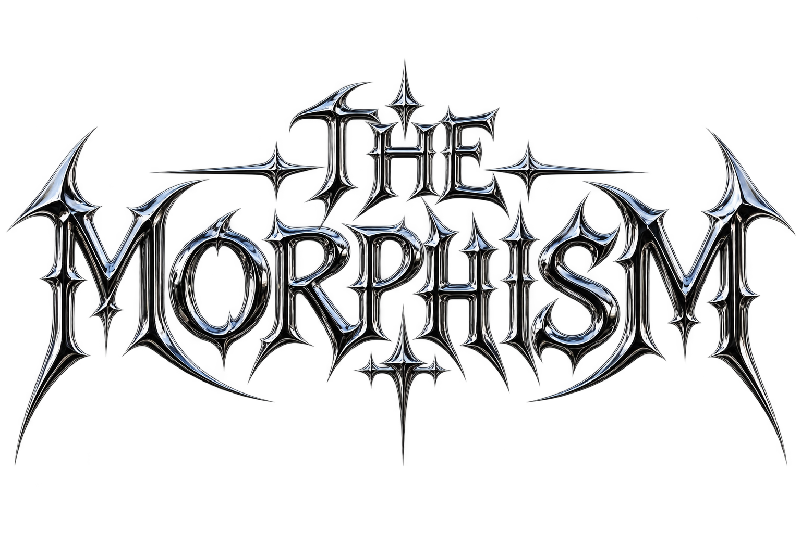
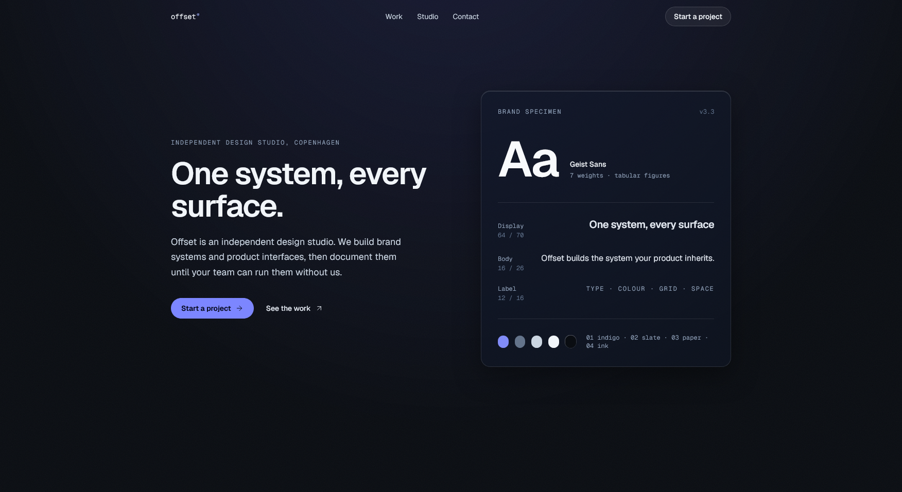
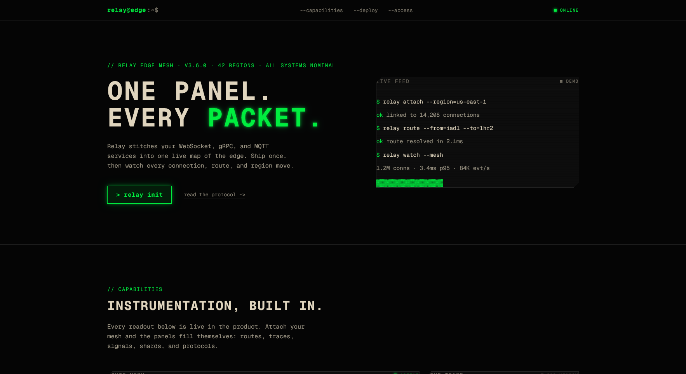
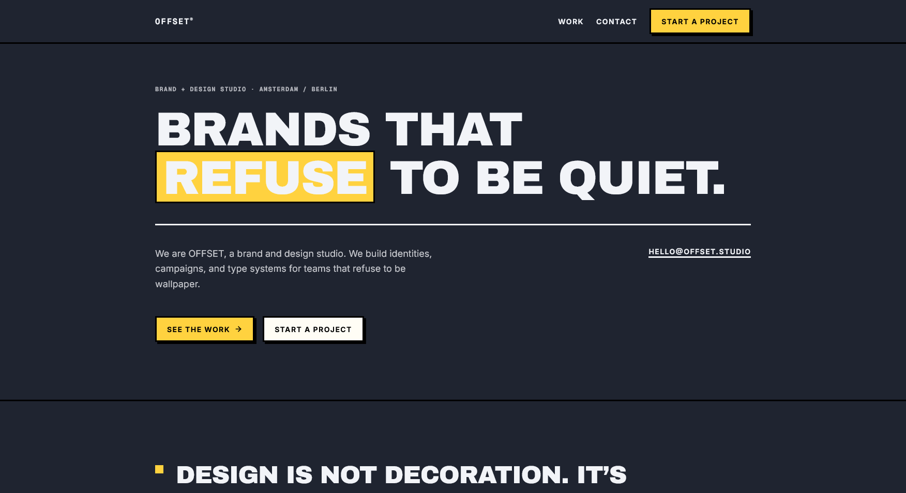
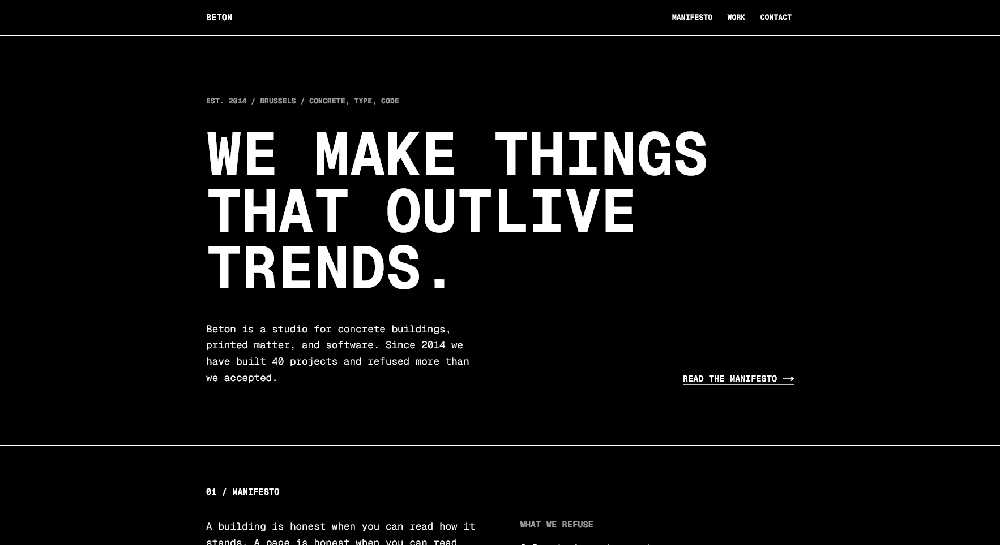
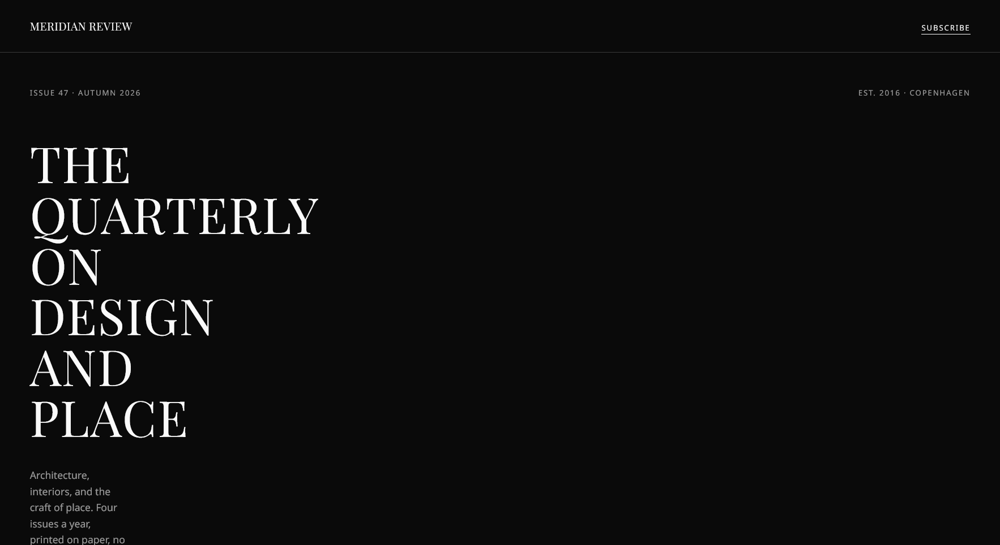
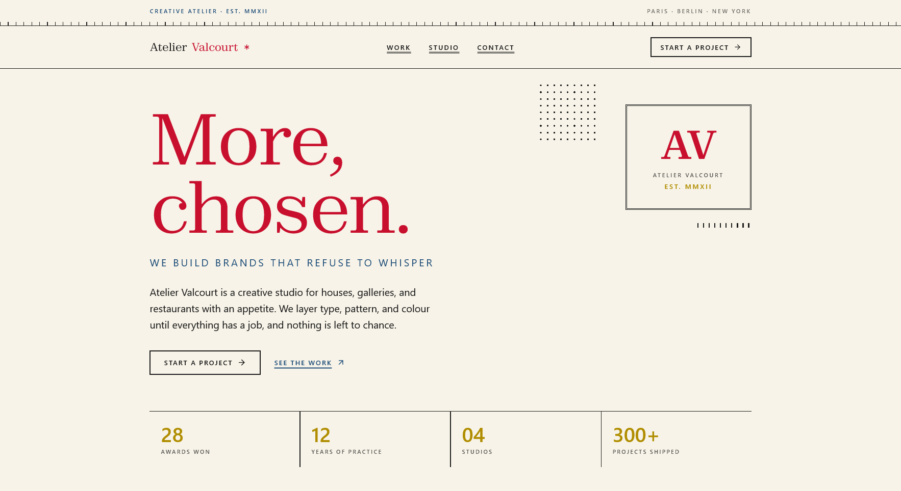
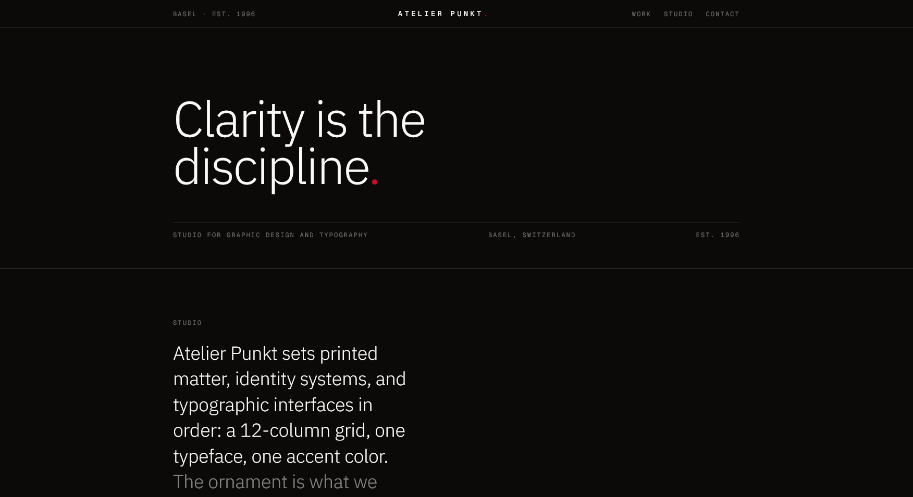
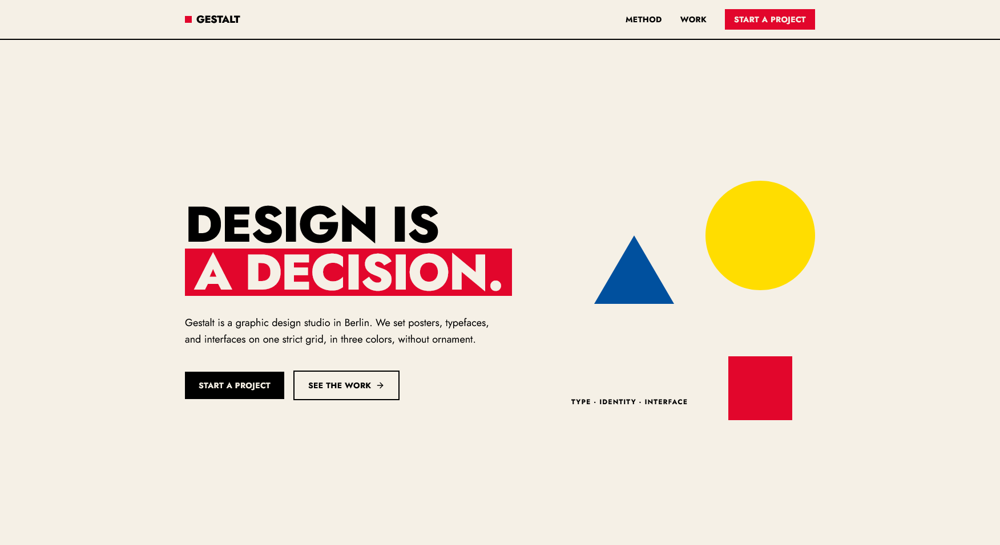

<p align="center">
  
</p>

# The Morphism


**A design skill for AI coding agents that refuses to look AI-generated.**

Multiple aesthetic styles. Exact CSS recipes. A motion system. A typographic scale. Named anti-patterns. The agent reads the brief, sets four dials (DEPTH / SOFTNESS / TRANSLUCENCY / GLOW), and ships interfaces with depth and glow. Not another purple-gradient hero with three equal cards.

---

## Preview

<table>
  <tr>
    <td width="25%"></td>
    <td width="25%"></td>
  </tr>
  <tr>
    <td><b>Glassmorphism</b><br/><sub>Frosted Glass · SaaS landing / Hero Overlays</sub></td>
    <td><b>Futurism</b><br/><sub>Mono Phosphor · Terminal / Dashboard</sub></td>
  </tr>
  <tr>
    <td width="25%"></td>
    <td width="25%"></td>
  </tr>
  <tr>
    <td><b>Neubrutalism</b><br/><sub>Thick Border · Portfolios / Dev Tools</sub></td>
    <td><b>Brutalism</b><br/><sub>Raw Monochrome · Avant-garde Studios / Zines</sub></td>
  </tr>
  <tr>
    <td width="25%"></td>
    <td width="25%"></td>
  </tr>
  <tr>
    <td><b>Minimalism</b><br/><sub>Minimal · Galleries / Luxury Brands</sub></td>
    <td><b>Maximalism</b><br/><sub>Maximal · Creative Agency / Fashion</sub></td>
  </tr>
  <tr>
    <td width="25%"></td>
    <td width="25%"></td>
  </tr>
  <tr>
    <td><b>Swiss Design</b><br/><sub>Flat Neutral · Editorial / Docs</sub></td>
    <td><b>Bauhaus</b><br/><sub>Flat Geometric · Posters / Arts & Culture</sub></td>
  </tr>
</table>

---

## The styles

### Morph Design

| Style | Character | Best for |
|---|---|---|
| **Glassmorphism** | Frosted glass, blur, translucent overlays | SaaS landing, hero overlays, nav bars, modals |
| **Futurism** | Mono, phosphor glow, terminal, near-black | Dev tools, terminals, dashboards, monitoring, gaming |
| **Neubrutalism** | Hard shadows, thick black borders, flat loud color | Portfolios, dev tools, ed-tech, playful brands |
| **Brutalism** | Raw, monochrome, exposed structure, zero polish | Galleries, museums, avant-garde studios, artists, zines |
| **Minimalism** | Serif display, ink-only, underlined controls, pure white | Publishing, magazines, galleries, fashion, luxury brands |
| **Maximalism** | Layered ornament, mixed type, abundance with a budget | Fashion, editorial, galleries, restaurants, creative agencies |

### Non-Morph

| Style | Character | Best for |
|---|---|---|
| **Swiss Design** | Flat, neutral, typographic, grid-disciplined | Editorial, docs, archives, museums, design systems |
| **Bauhaus** | Flat, geometric, primary colors, bold type | Posters, arts & culture, education, architecture |

One style per page. Never mix. The skill handles the decision. Each style comes with an exact CSS recipe, Tailwind v4 equivalents, per-style dial presets, color rules, motion character, copy voice, and named tells of what not to do.

Beyond the styles, the skill ships a shared craft layer:

- **A motion system** : easing tokens, a duration canon, page-load orchestration, hover/reveal/loading recipes, and reduced-motion nuance.
- **A typographic scale** : the 2+1 font rule, ratio-based sizing, measure, and weight contrast.
- **A layout system** : a spacing scale, z-index levels, and the "one layout family per page" rule.
- **Named anti-patterns** : THE PILL BADGE, THE EM-DASH, INTER-BY-DEFAULT, THE SOFT SHADOW, THE TRANSITION-ALL, and more. Each tell is named so the agent recognizes and avoids it.
- **A pre-emit self-critique** : six axes scored before shipping.

---

## Install

```bash
npx the-morphism init
```

Copies the skill into `skills/the-morphism/` plus agent entry files. Hermes auto-loads it; Claude Code, Codex, Cursor, and Cline read their entry files (see `--agent`).

| Command | Does |
|---|---|
| `npx the-morphism init` | SKILL.md + references + .txt template |
| `npx the-morphism init --core` | Only SKILL.md (no refs, no templates) |
| `npx the-morphism init --templates-only` | Only the plain-text prompt template |
| `npx the-morphism init --agent <name>` | + agent entry files: `auto` (detects), `all`, `claude`, `codex`, `cursor`, `cline` |

Re-run any time to update. Any agent: use `--templates-only` and paste the .txt into your system prompt, or `--agent all` for every entry file.

## Works with

The Morphism is agent-agnostic — one SKILL.md source of truth, entry files per agent:

| Agent | How it loads |
|---|---|
| Hermes (Nous Research) | Auto-loads `skills/the-morphism/` |
| Claude Code | `CLAUDE.md` or `.claude/skills/the-morphism/` (Agent Skill, `--agent claude`) |
| Codex / Cursor / Claude Code | `AGENTS.md` (universal entry, default install) |
| Cursor | `.cursor/rules/the-morphism.mdc` |
| Cline / Roo | `.clinerules/the-morphism.md` |
| Any agent | `templates/the-morphism.txt` pasted into the system prompt, or `npx skills add ensayiti/The-Morphism` |

[](https://skills.sh/ensayiti/The-Morphism)

---

## License

[MIT License](LICENSE) · Copyright (c) 2026 XEM
