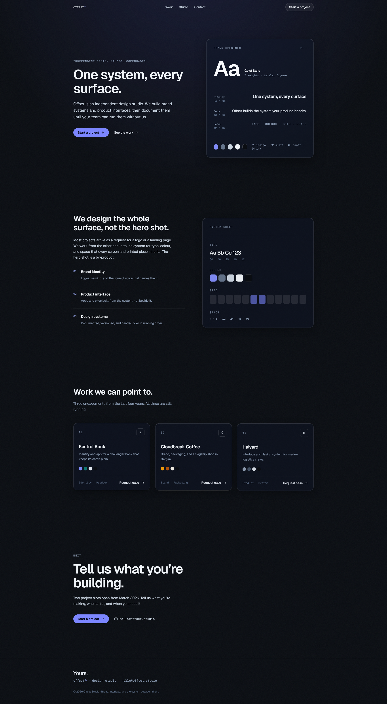
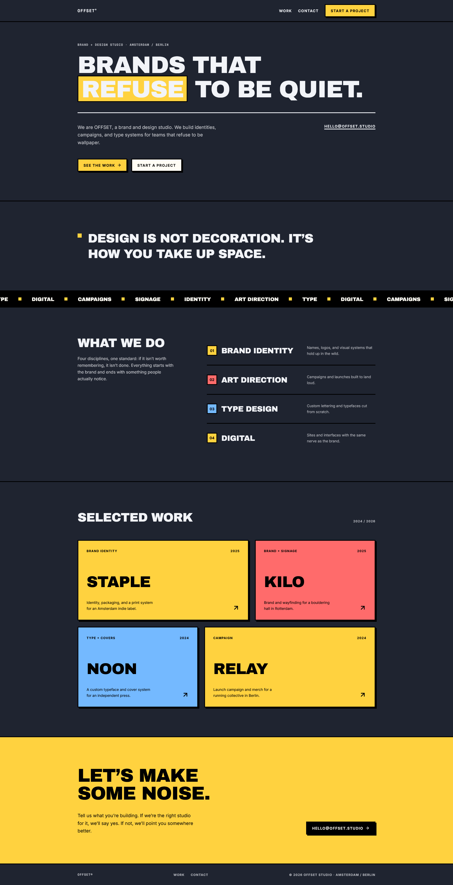
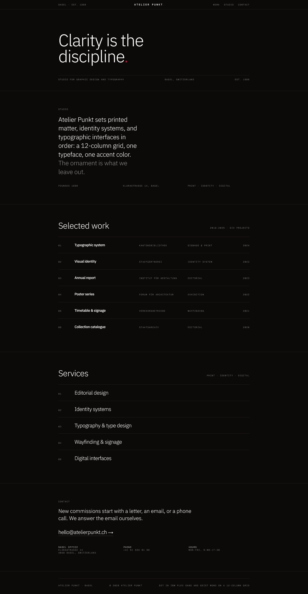
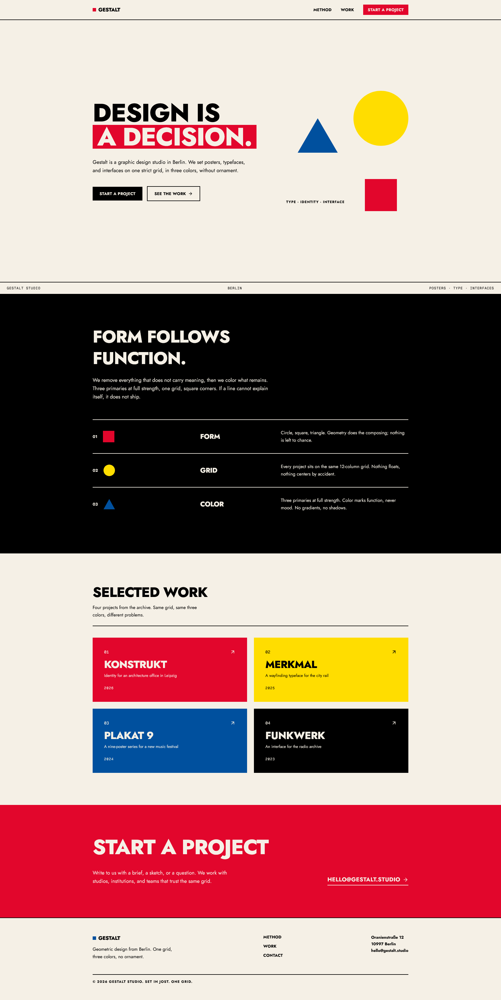

<p align="center">
  
</p>

# The Morphism

**A design skill for Hermes Agent that refuses to look AI-generated.**

Multiple aesthetic styles. Exact CSS recipes. A motion system. A typographic scale. Named anti-patterns. The agent reads the brief, sets three dials (DEPTH / SOFTNESS / TRANSLUCENCY), and ships interfaces with depth — not another purple-gradient hero with three equal cards.

---

## Install

```bash
npx the-morphism init
```

Copies the skill into `skills/the-morphism/` — Hermes auto-loads it from there.

| Command | Does |
|---|---|
| `npx the-morphism init` | SKILL.md + references + .txt template |
| `npx the-morphism init --core` | Only SKILL.md (no refs, no templates) |
| `npx the-morphism init --templates-only` | Only the plain-text prompt template |

Re-run any time to update. Non-Hermes users: use `--templates-only` and paste the .txt into your system prompt.

---

## The styles

| Style | Character | Best for |
|---|---|---|
| **Glassmorphism** | Frosted glass, blur, translucent overlays | SaaS landing, hero overlays, nav bars, modals |
| **Neubrutalism** | Hard shadows, thick black borders, flat loud color | Portfolios, dev tools, ed-tech, playful brands |
| **Swiss Design** | Flat, neutral, typographic, grid-disciplined | Editorial, docs, archives, museums, design systems |
| **Bauhaus** | Flat, geometric, primary colors, bold type | Posters, arts & culture, education, architecture |

One style per page. Never mix. The skill handles the decision — every style comes with an exact CSS recipe, Tailwind v4 equivalents, per-style dial presets, color rules, motion character, copy voice, and named tells of what not to do.

Beyond the styles, the skill ships a shared craft layer:

- **A motion system** — easing tokens, a duration canon, page-load orchestration, hover/reveal/loading recipes, and reduced-motion nuance.
- **A typographic scale** — the 2+1 font rule, ratio-based sizing, measure, and weight contrast.
- **A layout system** — a spacing scale, z-index levels, and the "one layout family per page" rule.
- **Named anti-patterns** — THE PILL BADGE, THE EM-DASH, INTER-BY-DEFAULT, THE SOFT SHADOW, THE TRANSITION-ALL, and more. Each tell is named so the agent recognizes and avoids it.
- **A pre-emit self-critique** — six axes scored before shipping.

---

## Preview

| Style | Full page | Hero |
|---|---|---|
| **Glassmorphism** |  |  |
| **Neubrutalism** |  |  |
| **Swiss Design** |  |  |
| **Bauhaus** |  |  |

---

## License

[MIT License](LICENSE) · Copyright (c) 2026 XEM
